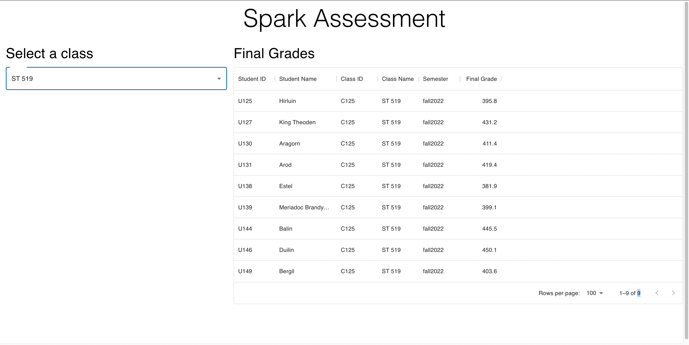

BUID: U81066856  
Name: Zhengxu Wang

# Spark! Software Engineering Assessment

This repo has the starter code for the Spark! Software Engineering Assessment. It contains everything that is needed to get started with this project. **Please read this entire file and follow the directions closely before attempting to start.**

Some code has been written for you and other code will need to be completed by you. You don't need to install any extra packages to complete the assessment. However, you are welcome to install extra packages if you deem them necessary -- make sure the `package.json` file is updated correctly. If we can't compile your code we can't assess your skills!

Please note, none of the code provided is final. You **will** need to modify most of the code. Modifications could include -- but are not limited to -- changing the function signature, adding more code, removing code, changing the passed attributes on a component.

## Project Requirements

Below is a list of things you must follow when working on the project. Not following these could impact your performance on this assessment.

1. All code must be written in Typescript -- not Javascript
2. Files should be organized in appropriately named folders -- In general you should not need to create more files.
3. You must perform regular Git commits as you work. **A final submission must have more than 4 git commits**
4. You must produce a website that closely resembles the provided example photo below.
5. Your code must compile and run
6. Your code should not make erroneous network calls.
7. You must document your code and be prepared to explain it to someone.

## Getting Started

### Project Goal

The goal is to build a portal that displays the final grades for all students in a particular class from a given semester. All the information required can be retrieved from the API. You might need to make multiple queries to retrieve all the required information. You will also need to compute the final grade using the combination of assignment grade and assignment weight (provided by the API).

The website should look like this image:

### Required Software

To get started with this project you will need the following setup on your computer:

- Node.js Version 19 or greater
- VS Code or your favorite editor that supports Typescript (we really recommend VS Code though)
- Git Version Control

### Install and Run

1. Clone this repo to your computer
2. Open the folder in your editor
3. In a terminal (ie Command Prompt) run `npm install` to install all the required packages.
4. Fill in all the variables in `globals.ts` file. **You will have lots of issues if you don't do this.**
5. Run `npm start` to see if the website launches on your computer.
6. Resolve any issues you might have in running the website.

## Code Overview

The majority of the code lives in only a few files, below is a short description of each one.

### `App.tsx`

This is the "home" of the app and is where everything starts from. This does not mean you should write _all_ your code in this file though!

### `/components/GradeTable.tsx`

This file contains a stub function for you to fill in with the code required to present the grade table. You might also need to change the function signature.

### `/types/api_types.ts`

This file is where you can store interfaces and types for data you receive from the API. Feel free to add more code to this file.

### `/utils/calculate_grade.ts`

This file stores some stub functions to help you get started on the process of calculating all the final grades. Feel free to add more code to this file.

### `globals.ts`

This file stores some global variables. You will need to fill them out as specified in the "Getting Started" section of this document.

### Features of the final website

The final website should have the following features:

1. A dropdown selection to select the desired class from the list.
2. A table on the right hand side that displays the calculated grades
3. The table should indicate to users when data is being loaded from the API

## Project Resources:

### API

The API can be found here: https://dscs519-assessment.azurewebsites.net/api/
You can explore the API routes using the Swagger UI (it might take ~15s to load): https://dscs519-assessment-swagger.azurewebsites.net/api/ui

The Swagger UI allows you to explore each API route and read the documentation. This is a really good point to start after you have cloned the project code.

**Important**: Each request you make to the API must include your BU ID. This is for grading purposes.
**Important**: Each request must also include the `x-functions-key` header along with the key provided to you via Piazza.

## Help

If you need help you have two main methods for support:

Piazza: You can post your questions on the Piazza class page. If you include log files or code -- please do not post pictures. Instead, use the "Code" function on Piazza. If you are posting code you wrote, make the post private to instructors first. Then, we will make it public if your code is deemed not private.

Office Hours: We will be running special office hour sections just for the assessment. Announcements will be made on Piazza.

If you are currently on the wait list, please reach out over email for help and to learn about the SE assessment office hours.

## Available Scripts

In the project directory, you can run:

### `npm start`

Runs the app in development mode.\
Open [http://localhost:3000](http://localhost:3000) to view it in the browser.

The page will reload if you make edits.\
You will also see any lint errors in the console.

### `npm test`

Launches the test runner in the interactive watch mode.\
See the section about [running tests](https://facebook.github.io/create-react-app/docs/running-tests) for more information.

### `npm run build`

Builds the app for production to the `build` folder.\
It correctly bundles React in production mode and optimizes the build for the best performance.

The build is minified and the filenames include the hashes.\
Your app is ready to be deployed!

See the section about [deployment](https://facebook.github.io/create-react-app/docs/deployment) for more information.

## Learn More

You can learn more in the [Create React App documentation](https://facebook.github.io/create-react-app/docs/getting-started).

To learn React, check out the [React documentation](https://reactjs.org/).
